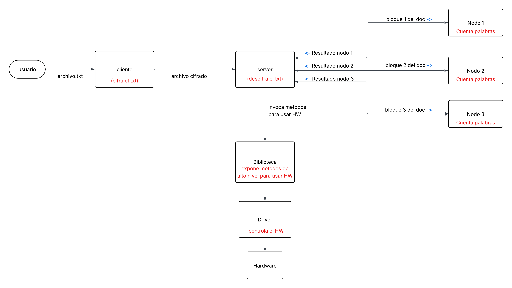

# RoboticTEC

### Grupo:

- Albert Vega Camacho  
- Kevin Chinchilla
- Byron Mata

## > Introducción 

### Teoría

Este proyecto integra varios conceptos fundamentales del funcionamiento de los sistemas operativos, la interacción con hardware y el diseño de sistemas distribuidos. A continuación, se presenta una síntesis de los temas centrales involucrados:

- **Drivers de dispositivo (Device Drivers):** Un driver es un módulo del kernel que permite la comunicación entre el sistema operativo y dispositivos físicos. Proporciona una interfaz estandarizada para que capas superiores del software puedan interactuar con el hardware sin conocer sus detalles específicos.

- **Procesamiento distribuido:** Consiste en dividir una tarea compleja en subtareas que se ejecutan de forma paralela en múltiples nodos o procesadores. Esto permite una mayor eficiencia y tiempos de respuesta reducidos. En este proyecto se utiliza **inet** para implementar la comunicación y coordinación entre los nodos del clúster.

- **Cifrado y seguridad:** El cifrado de texto permite proteger la información transmitida entre cliente y servidor. Cada grupo debe seleccionar su propio algoritmo de cifrado para transformar el contenido del archivo antes de distribuirlo para su procesamiento.

- **Comunicación Cliente-Servidor:** Se establece un flujo de información en el que el cliente cifra un archivo y lo envía al servidor. El servidor distribuye la carga de descifrado y análisis entre múltiples nodos, orquestando su ejecución para obtener un resultado final consolidado.

- **Sistemas embebidos y GPIO:** Se utilizará un sistema embebido para construir un prototipo mecánico capaz de simular una mano que presiona teclas o escribe palabras. La interacción física se logrará mediante interfaces como GPIO, que permiten el control directo de componentes electrónicos desde software.

---

### Breve descripción del proyecto

El proyecto consiste en desarrollar un sistema completo tanto a nivel de hardware como de software que sea capaz de recibir un archivo de texto cifrado, analizarlo utilizando procesamiento distribuido para identificar la palabra más repetida, y posteriormente escribir dicha palabra en una superficie (física o digital) mediante un dispositivo robótico.

Para lograr esto, el sistema se divide en varios componentes clave:

- Un **cliente** que cifra el archivo original.
- Un **servidor** que recibe el archivo, coordina su descifrado y procesamiento distribuido.
- Un **clúster de procesamiento** con 3 nodos que trabajan en paralelo para analizar el contenido.
- Un **driver** que permite al sistema operativo comunicarse con el hardware.
- Una **biblioteca de funciones** en C que abstrae la interacción con el driver.
- Un **dispositivo físico (la "mano robótica")**, que interpreta las órdenes y escribe la palabra más repetida del archivo, junto con su frecuencia.

---

### ¿Qué se espera en este documento?

Este documento tiene como objetivo explicar:
- Los conceptos teóricos en los que se fundamenta el proyecto.
- Las herramientas y entornos utilizados en el desarrollo.
- Las decisiones de diseño tanto en el plano software como hardware.
- La estructura y flujo general del sistema, con apoyo de diagramas, ilustraciones y explicaciones claras para facilitar su comprensión y replicabilidad.

## > Ambiente de desarrollo

Para el desarrollo de este proyecto se utilizó el lenguaje de programación **C**, ejecutado bajo un entorno **Linux** sin el uso de máquinas virtuales, sino de manera local en una partición. La compilación y organización del código se gestionó mediante un **Makefile**, asegurando una instalación ordenada y reproducible de los módulos del sistema.

### Bibliotecas y herramientas utilizadas

Además de las **bibliotecas estándar del lenguaje C**, como:

- `<stdio.h>`: Para operaciones de entrada y salida estándar (como `printf`, `fopen`, etc.).
- `<stdlib.h>`: Para manejo de memoria, conversión de tipos, y control del proceso (como `malloc`, `exit`, etc.).
- `<string.h>`: Para manipulación de cadenas de texto (como `strcpy`, `strcmp`, etc.).
- `<unistd.h>`: Para llamadas al sistema POSIX como `fork`, `exec`, `read`, `write`, `sleep`, etc.

Se utilizaron también otras bibliotecas importantes según la funcionalidad del sistema:

#### Red y comunicación

- `<arpa/inet.h>`  
  Permite la conversión entre direcciones IP y estructuras de red. Fue esencial para implementar la comunicación entre el **cliente** y el **servidor**, usando sockets TCP/IP.

#### Seguridad y cifrado

- `<ctype.h>`  
  Se usó principalmente para validación y transformación de caracteres (como `tolower`, `isalpha`, etc.), útil en el proceso de **cifrado/descifrado** de texto.

#### Concurrencia

- `<pthread.h>`  
  Utilizada para la creación y gestión de hilos (**threads**), necesarios para implementar ciertas tareas paralelas dentro del clúster de procesamiento, ya que cada uno de los 3 nodos y el server deben ejecutarse en paralelo en sockets diferentes.

#### Sistema de archivos y utilidades

- `<sys/stat.h>`  
  Se usó para manejar y verificar atributos de archivos, como permisos y existencia (`stat`, `mkdir`, etc.).

- `<limits.h>`  
  Proporciona constantes relacionadas a los límites de tipos de datos, como `INT_MAX`, utilizado para evitar desbordamientos o definir rangos de comparación seguros.

---

### Herramientas adicionales

- **GCC (GNU Compiler Collection):** Compilador utilizado para construir los binarios del proyecto.
- **Make:** Herramienta para automatizar la construcción del proyecto mediante un archivo `Makefile`.
- **GitHub:** Sistema de control de versiones y repositorio remoto para el desarrollo colaborativo y documentación externa.
- **Arduino IDE:** Herramienta para sintetizar y cargar el firmware correspondiente al microcontrolador que orquesta el hardware, en este caso se utiliza de microcontrolador el Arduino UNO 

---

Este conjunto de bibliotecas y herramientas permitió estructurar un sistema robusto y modular que cumple con los requerimientos de interacción entre software, hardware y sistemas distribuidos.

## > Detalles del diseño del programa desarrollado

El sistema se estructura en **dos grandes bloques funcionales** que permiten abordar tanto el procesamiento distribuido como la interacción con hardware embebido. A continuación, se describe el diseño general del programa, acompañado de su respectiva arquitectura modular.

---

### Diseño del sistema de software distribuido

El flujo inicia con el **usuario**, quien proporciona un archivo de texto (`archivo.txt`). Este archivo es procesado por el módulo **cliente**, el cual lo **cifra carácter por carácter** utilizando un algoritmo XOR.

El archivo cifrado es enviado al módulo **servidor**, el cual se encarga de:

- **Descifrar** el contenido recibido.
- **Dividir el documento** en tres bloques.
- **Distribuir el trabajo** entre tres nodos del clúster para realizar la tarea de **conteo de palabras** en paralelo.
- **Recoger los resultados** de cada nodo y determinar cuál es la palabra más repetida en el texto completo.

Cada nodo ejecuta de forma paralela una tarea de conteo parcial, utilizando técnicas de programación distribuida, permitiendo optimizar el tiempo de respuesta y aprovechar múltiples núcleos de procesamiento.

---

### Diseño del subsistema de hardware y control

El sistema embebido fue desarrollado en una arquitectura modular compuesta por:

#### Biblioteca de alto nivel

Se construyó una **biblioteca estática (.a)** en C, que contiene métodos como `arduino_write`, `send_word_as_binary`, entre otros. Esta biblioteca sirve como **puente de abstracción** para la capa superior.

#### Driver de dispositivo

El driver fue desarrollado como un **módulo del kernel de Linux**, compilado e insertado dinámicamente con `insmod`. Se encarga de:
- Administrar los accesos al hardware.
- Exponer primitivas de bajo nivel para el control de actuadores.
- Garantizar que las órdenes se ejecuten de manera sincronizada y segura.

#### Hardware

El prototipo hardware consiste en un sistema capaz de **simular una mano**, que presiona teclas físicas del computador, se utiliza Arduino como microcontrolador. La interacción se logra a través de pines **GPIO**, elegidos por su simplicidad, flexibilidad y bajo nivel de abstracción. La "mano" se simula por medio del movimiento de un servomotor

El dispositivo es capaz de:
- Moverse 45 grados para simular escritura o digitación.
- Presionar una tecla.

---

### Diagrama general del sistema

El siguiente diagrama de bloques representa el flujo del sistema y las interacciones entre sus componentes:

---

Esta arquitectura modular facilita el desarrollo, prueba y mantenimiento independiente de cada componente del sistema, asegurando una mejor trazabilidad de errores, escalabilidad y reutilización del código en contextos similares.

